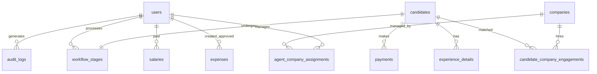
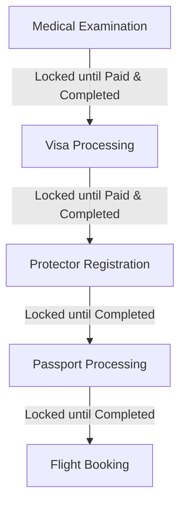

# MINT International Platform - System Documentation

Welcome to the comprehensive system documentation for the **MINT International Platform**. This document details the platform's architecture, database design, role-based access control (RBAC), and step-by-step functionality for each user role and processing pipeline.

---

## 1. Project Overview
The MINT International Platform is a comprehensive, role-based, enterprise web application designed to manage overseas employment workflows, candidate intake, employer requirements, operational finances, and system analytics. It streamlines the complex administrative and verification pipeline required to send candidates abroad for work, reducing friction between receptionists, process agents, accountants, and administrators.

### Core Tech Stack
*   **Framework**: Next.js 15 (App Router) with React 19 and TypeScript.
*   **Styling**: Tailwind CSS & Radix UI / Shadcn Component library for a modern, glassmorphic dashboard interface.
*   **Database & ORM**: PostgreSQL with Drizzle ORM.
*   **Authentication**: NextAuth.js (Credentials Provider) using JSON Web Tokens (JWT) with password hashing via `bcryptjs`.
*   **API Documentation**: OpenAPI JSON (`/api/openapi`) with Swagger UI (`/api/docs`).

---

## 2. Database Architecture & Schema
The database is structured to track candidates from their initial registration, through interview matching (engagements) with hiring companies, into a strict sequential workflow, alongside bookkeeping for operational payments, staff salaries, and company expenses.

### Table Definitions

1.  **`users`**: System users (staff) who access the dashboard.
    *   `id` (UUID, PK)
    *   `email` (VARCHAR, Unique)
    *   `passwordHash` (VARCHAR)
    *   `role` (ENUM: `super_admin`, `admin`, `receptionist`, `process_agent`, `accountant`)
    *   `fullName` (VARCHAR)
    *   `phone` (VARCHAR)
    *   `isActive` (BOOLEAN, default: true)
2.  **`candidates`**: Overseas job seekers registered on the platform.
    *   `id` (UUID, PK)
    *   `fullName`, `fatherName` (VARCHAR)
    *   `passportNo` (VARCHAR, Unique)
    *   `status` (ENUM: `active`, `in_process`, `completed`, `rejected`)
    *   `createdBy` (FK -> `users.id`)
    *   `profileImage`, `cvFile` (VARCHAR url references)
3.  **`companies`**: Overseas employers requesting candidate hires.
    *   `id` (UUID, PK)
    *   `name`, `contactPerson`, `country` (VARCHAR)
    *   `requirements` (TEXT)
4.  **`candidate_company_engagements`**: Interviews and selection status before workflow initialization.
    *   `id` (UUID, PK)
    *   `candidateId` (FK -> `candidates.id`)
    *   `companyId` (FK -> `companies.id`)
    *   `agentId` (FK -> `users.id`)
    *   `interviewStatus`, `interviewResult` (VARCHAR)
    *   `lockedByWorkflow` (BOOLEAN): Set to true once a processing workflow starts to prevent modification.
5.  **`workflow_stages`**: The core sequential candidate processing pipeline.
    *   `id` (UUID, PK)
    *   `candidateId` (FK -> `candidates.id`)
    *   `companyId` (FK -> `companies.id`)
    *   `assignedAgent` (FK -> `users.id`)
    *   *Medical Stage*: `medicalStatus` (ENUM), `medicalPaymentStatus` (ENUM), `medicalNotes` (TEXT)
    *   *Visa Stage*: `visaStatus` (ENUM), `visaPaymentStatus` (ENUM), `visaNotes` (TEXT)
    *   *Protector Stage*: `protectorStatus` (ENUM), `protectorPaymentStatus` (ENUM), `protectorNotes` (TEXT)
    *   *Passport Stage*: `passportStatus` (ENUM), `passportPaymentStatus` (ENUM), `passportNotes` (TEXT)
    *   *Flight Stage*: `flightStatus` (ENUM), `flightPaymentStatus` (ENUM), `flightNotes` (TEXT)
    *   `overallStatus` (ENUM: `initiated`, `in_progress`, `completed`, `cancelled`)
6.  **`payments`**: Payment entries requested by Process Agents and approved by Accountants.
    *   `id` (UUID, PK)
    *   `candidateId` (FK -> `candidates.id`)
    *   `workflowId` (FK -> `workflow_stages.id`)
    *   `paymentType` (ENUM: `medical`, `visa`, `protector`, `passport`, `flight`)
    *   `amount` (NUMERIC)
    *   `paymentStatus` (ENUM: `pending`, `paid`, `rejected`, `refunded`)
    *   `verifiedBy` (FK -> `users.id`)
7.  **`salaries`**: System user payroll management.
    *   `id` (UUID, PK)
    *   `userId` (FK -> `users.id`)
    *   `basicSalary`, `allowances`, `deductions`, `netSalary` (NUMERIC)
    *   `salaryMonth` (DATE), `paymentStatus` (ENUM: `pending`, `paid`, `cancelled`)
8.  **`expenses`**: General operational expenses of the platform.
    *   `id` (UUID, PK)
    *   `category`, `amount`, `currency` (VARCHAR / NUMERIC)
    *   `status` (ENUM: `pending`, `approved`, `rejected`)
    *   `createdBy`, `approvedBy` (FK -> `users.id`)
9.  **`audit_logs`**: Tracks DB modifications for transparency and compliance.
    *   `id` (UUID, PK), `userId` (FK -> `users.id`), `action` (VARCHAR), `tableName` (VARCHAR), `recordId` (UUID), `oldValues`, `newValues` (JSONB)

---

## 3. Authentication & RBAC (Role-Based Access Control)
The application uses NextAuth for session handling. Once a user logs in, their JWT is populated with their role information.

### Role Authorization Matrix
Centralized in `lib/rbac.ts`, permissions restrict UI elements and API endpoints.

| Feature Area | Super Admin | Admin | Receptionist | Process Agent | Accountant |
| :--- | :--- | :--- | :--- | :--- | :--- |
| **Candidates** | CRUD, Export, PDF | Read Only | CRUD | Read, Update | Read Only |
| **Users** | CRUD, Assign Roles | CRUD, Limited Role Assign | None | None | None |
| **Companies** | CRUD | CRUD | Read Only | Read Only | Read Only |
| **Workflows** | CRUD, Reset | Read Only | Read Only | CRUD (Assigned) | Read Only |
| **Payments** | CRUD, Approve, Export | Read Only | None | Read, Create Request | Read, Update, Approve |
| **Expenses** | CRUD, Approve | Read Only | None | None | CRUD, Approve |
| **Salaries** | CRUD | None | None | None | CRUD |
| **Reports** | Full | Full | None | Summary | Financials |

### Middleware & API Security
*   **Route Guards**: Next.js Middleware (`middleware.ts`) inspects the incoming token and checks the user's role against the `routeRoleMap`. Unauthorized requests are redirected to `/unauthorized`.
*   **API Guards**: The backend endpoints import safety handlers from `lib/nextauth.ts` (`requireRole`, `requireAuth`) to programmatically reject requests that bypass frontend routing.

---

## 4. Role Walkthroughs (How Each Role Works)

Each staff member is assigned a specific role, granting access to a customized layout and functional workflow.

### 4.1 Super Admin
The **Super Admin** acts as the system controller with override capabilities.
*   **Redirect Destination**: `/dashboard/admin`
*   **Key Responsibilities**:
    1.  **User Provisioning**: Creating, editing, and deactivating accounts for receptionist, agent, accountant, and admin roles.
    2.  **System Diagnostics**: Reviewing all system statistics including total revenue, active workflows, candidate pipelines, and company rosters.
    3.  **Override Actions**: Can perform hard-resets on workflows, override stage selections, and bypass payment requirements.
    4.  **Financial Extraction**: Holds exclusive access to export full system financial statements in JSON/CSV formats (`/api/admin/reports/financial`).

### 4.2 Admin
The **Admin** handles day-to-day oversight of employees and company relationships.
*   **Redirect Destination**: `/dashboard/users`
*   **Key Responsibilities**:
    1.  **Employee Directory**: Manages the employee roster (`/dashboard/admin/employees`), tracking join dates, departments, and active statuses.
    2.  **Client Management**: Creates and updates overseas hiring company records, including requirements, email contacts, and phone details.
    3.  **Agent Assignments**: Links specific Process Agents to hiring companies (`/dashboard/admin/assignments`), assigning ownership of workflows.
    4.  **Engagement Supervision**: Oversees candidate interview matchings (`/dashboard/admin/engagements`).

### 4.3 Receptionist
The **Receptionist** serves as the intake gateway for all incoming candidates.
*   **Redirect Destination**: `/dashboard/candidates`
*   **Key Responsibilities**:
    1.  **Candidate Intake (CRUD)**: Fills out candidate application details, including passport numbers, academic qualifications, and profile pictures.
    2.  **Document Intake**: Uploads scans of candidate CVs and passports to `/api/uploads/profile-images` and `/api/uploads/cv-files`.
    3.  **Search & Filters**: Utilizes searching and pagination to track active, rejected, and completed candidates.
    4.  **PDF Resumes**: Generates standard formatted CV sheets (Client PDF/Own PDF) for foreign clients.

### 4.4 Process Agent
The **Process Agent** guides candidates through the five stages of recruitment.
*   **Redirect Destination**: `/dashboard/agent`
*   **Key Responsibilities**:
    1.  **Selection Pool**: Views candidate entries and updates the interview status/result with assigned companies. Once matched and selection is confirmed, the engagement is locked, and a Workflow is generated.
    2.  **Workflow Processing**: Manages candidate stages. Collects medical report numbers, PNR flight codes, protector numbers, and uploads verifying files.
    3.  **Payment Initiation**: Initiates requests to the accountant for required stage fees (e.g. visa processing fees).
    4.  **Pipeline Analysis**: Tracks target counts for candidates awaiting selection, active workflows, and completed targets.

### 4.5 Accountant
The **Accountant** controls cash flows and operational spending.
*   **Redirect Destination**: `/dashboard/accounts`
*   **Key Responsibilities**:
    1.  **Payment Approvals**: Views incoming candidate payment requests (medical fees, visa processing costs). Verifies transactions and changes status to `Paid` or `Rejected` to unlock stages for Agents.
    2.  **Expense Log**: Manages operating expenses, tracking receipt images, category breakdowns, and status toggles.
    3.  **Payroll Slip Generation**: Manages basic salaries, allowances, deductions, and payment status for the employee roster.
    4.  **Accounting Reports**: Accesses summary accounts dashboards showing general financial health metrics.

---

## 5. Candidate Workflow & Sequential Pipeline
The processing pipeline is a strict state machine defined in `workflowStages` table in the database and managed inside `/dashboard/workflows/[id]/page.tsx`.

### Workflow States and Sequence
The workflow goes through 5 consecutive stages:

1.  **Medical Examination (Stage 1)**:
    *   *Input Fields*: Medical Center, Report Number.
    *   *Financial Dependency*: Requires accountant approval (Payment Status = `paid`) before the stage can be marked "Completed" by the Agent.
2.  **Visa Processing (Stage 2)**:
    *   *Unlock Rule*: Unlocked only after Medical Stage = `completed`.
    *   *Input Fields*: Visa File Number, Embassy.
    *   *Financial Dependency*: Requires accountant approval (Payment Status = `paid`) before it can be marked "Completed".
3.  **Protector Registration (Stage 3)**:
    *   *Unlock Rule*: Unlocked only after Visa Stage = `completed`.
    *   *Input Fields*: Protector Number.
4.  **Passport Processing (Stage 4)**:
    *   *Unlock Rule*: Unlocked only after Protector Stage = `completed`.
    *   *Input Fields*: Internal notes and verification document uploads.
5.  **Flight Booking (Stage 5)**:
    *   *Unlock Rule*: Unlocked only after Passport Stage = `completed`.
    *   *Input Fields*: Flight PNR, Airline.

### Key Logic Systems

*   **Locking System**: If a Process Agent attempts to interact with or save updates on a stage whose predecessor is not marked `completed` (e.g. Visa stage when Medical is still `pending` or `in_progress`), the card UI displays a lock symbol, input elements are disabled, and updates are rejected.
*   **Document Uploads**: Each stage supports uploading multiple PDF/image files. Files are handled by the unified `/api/uploads/{type}` endpoint which saves them to `public/uploads` and tracks filenames, MIME types, and file sizes.
*   **Retraction Mechanism**: If an error is identified, a stage can be retracted (rolled back). There are two modes of retraction:
    *   *Soft Retraction*: Reverts the current stage to `pending` or `in_progress` without affecting previous stages.
    *   *Hard Retraction*: Reverts both the current stage and preceding completed stages (e.g. resetting back to Medical).
*   **Overall Workflow Status**: The workflow's `overallStatus` automatically changes:
    *   `initiated`: Workflow created.
    *   `in_progress`: At least one stage is under processing.
    *   `completed`: Flight Booking stage (final stage) is marked `completed`.
    *   `cancelled`: Manually set by Super Admin.
